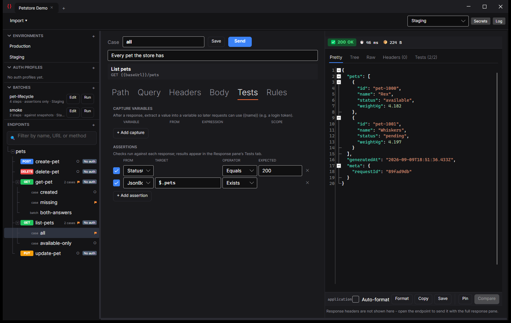

# Fubar API Studio

A fast, cross-platform desktop **API client** — think Postman/Insomnia, but native, open source,
and built on [Avalonia](https://avaloniaui.net/) + .NET 10. Design requests, manage environments and
secrets, import OpenAPI/Swagger specs, and handle real OAuth 2.0 flows — all from one window.

[](https://github.com/Fubar83/fubar/actions/workflows/ci.yml)
[](https://github.com/Fubar83/fubar/actions/workflows/build.yml)
[](LICENSE)
[](https://dotnet.microsoft.com/)
[](#download)

> **Status:** pre-1.0 and under active development. Expect rough edges; feedback and PRs welcome.

<!-- Screenshots: see docs/images/README.md for what each shot must show. Uncomment as they land -
     a missing image renders as a broken icon, which reads worse than no image at all.

-->

## Features

- **Endpoints, and cases of them.** An endpoint is what your API offers — `GET
  {{baseUrl}}/orders/{orderId}`, bearer auth, an `Accept` header — and a **case** is one way of
  calling it: an id that exists, an id that does not, the page-two query. Cases live beside the
  endpoint (`cases/not-found.json`), each stating only what is different about its call, so a second
  case is a small file rather than a copy of everything. Running the endpoint runs every case.

  Two placeholder syntaxes, on purpose: `{orderId}` is the endpoint's shape and a case fills it,
  `{{baseUrl}}` is the environment's value. A `{param}` nobody filled is left visible in the URL
  rather than emptied — `/orders/` would be a different request that gets a plausible-looking answer
  from the wrong resource.

  New workspaces are laid out this way. An existing one is never converted behind your back:
  **Convert to endpoints…** shows you what it will do, copies the originals to `.fubar/backup/`, and
  refuses rather than guessing when a name would collide.
- **Regression testing against recorded snapshots.** Record what every request answers, then check
  later runs against it: `Judge by → Recorded snapshot` in the Run window, or `fubar run --oracle
  snapshot` in CI. **A missing snapshot fails the run** — "nothing to compare, therefore fine" is how
  a suite stops testing without anyone noticing.

  Recording is always something you asked for, never something a comparison run does when it finds
  nothing; a snapshot that writes itself on the first failing run tests nothing ever again and does it
  silently.

  Snapshots are committed, so they are **redacted before they are written** — a token in a response
  never reaches the file — and **normalised**, so `"generatedAt"` is stored as `<timestamp>` and the
  file does not churn on every re-record. You choose when saving whether a snapshot is for the one
  environment or shared by all of them.
- **Does staging still agree with production?** `Judge by → Compare with Production`, or `fubar run
  orders --oracle env:Production`. Everything is sent twice, interleaved, and the run reports the
  fields where the two answers differ — each side sent through exactly the same code path, so a
  difference is a difference between the systems rather than between two ways of asking.
- **Tolerances, for the fields that legitimately move.** `{ "path": "$.total", "numeric": 0.01 }`, or
  `withinSeconds`, `matches`, `lengthWithinPercent`, `oneOf`. Ignoring a total because it drifts by a
  cent stops checking the total; a tolerance forgives the cent and still catches the euro. Both sides
  have to satisfy the rule, so `$.requestId matches ^[0-9a-f]{32}$` forgives a regenerated id and
  still fails when that field comes back as an error message. What was forgiven is counted and shown.
- **Batches, for the occasions you have a name for.** `batches/smoke.json` lists the calls to make
  together and what should judge them; run it from the left pane or as `fubar run @smoke`. A batch
  sits beside the collection rather than inside it — the tree says what your API has, a batch says
  what to call this time. A step naming something that has since been renamed **errors**; a batch that
  quietly shrank would keep passing while testing one thing fewer.
- **Rules inherit, and say what they add and remove.** Ignored paths, redactions, normalisations and
  tolerances all resolve workspace → folders → endpoint → case, with a batch's own rules last. A level
  states what it *changes* (`{ "add": [...], "remove": [...] }`), so one extra rule on one endpoint
  does not mean restating its folder's — and does not silently stop inheriting them.
- **Start from nothing.** *New Workspace…* — from the empty state, or the `+` in the title bar — takes
  an empty folder and lays out `fubar.json`, `collections/`, `environments/` and a `.gitignore` for
  the local-only execution history, then opens it. From there you build collections and environments,
  or import what you already have from OpenAPI, Postman or cURL. A workspace is a folder of plain
  files, so it belongs in the repository it tests; pointing *New Workspace* at a folder that is
  already one opens it untouched rather than reinitialising it.
- **Run a whole collection, in order.** Right-click a folder (or the workspace) → **Run**. Every request
  in it is sent top to bottom in the order the left pane shows, each one's captures and assertions
  applied as it goes — so a login that captures `{{token}}` feeds the nineteen requests after it, which
  is the thing that makes a collection worth having rather than a folder of bookmarks. The window lists
  the whole plan before it starts, fills each row in as it lands, and ends on a one-line verdict.
  Options for stopping at the first failure (worth it for a chain, where carrying on just repeats the
  same failure), a delay between requests for rate-limited APIs, and a name filter.

  **A status code never fails a run on its own — only an assertion or a transport error does.** You can
  assert `StatusCode Equals 404` deliberately, so a runner that also called 4xx bad would be arguing
  with you about the thing you just told it to expect. Any non-2xx nobody asserted on is still flagged
  on its row, so nothing hides. A cancelled or empty run is never reported green.
- **Run it in CI.** The same binary is a batch tool: `FubarAPIStudio run --env Staging --report
  results.xml` runs the collection, writes **JUnit XML** your build system already knows how to render,
  and exits `0` / `1` / `2` — passed, failed, could not run. A failed assertion becomes a failed test on
  the build page with its message, rather than a line in a log nobody opens. `--report results.json`
  gets the whole thing as JSON instead; captured **values** are never written to either, since a report
  file is exactly the thing that gets attached to a build and kept.

  Only flags with no meaning on screen switch it into batch mode, so starting the app normally is
  untouched. A run that matches nothing exits `1`, not `0` — "no tests ran, so it passed" is one typo in
  `--filter` away.
- **Request builder** — method + URL bar with live `{{variable}}` highlighting, and tabs for
  Params, Headers, Body, Auth, and per-request History/replay. URL and Params stay in two-way sync.
- **Environments & variables** — `{{key}}` resolves from the active environment. Values can be marked
  **secret**, and some variables are **session-only** (held in memory, never written to disk).
- **Setting OAuth up is guided, not guessed.** Paste your provider's issuer and **Discover** fills
  the token and authorize endpoints from its `/.well-known/openid-configuration`, with its own scopes
  offered as buttons. The editor states permanently what requests using the profile will send, and
  lists the `{{variables}}` the token request needs with which are undefined — before you press Test,
  not as a failure afterwards. After Test the **token response** is shown, and any field is one click
  from becoming a capture, so the JSONPath comes from a response that actually arrived rather than a
  guess at what the provider calls things.
- **Sign in with Google, Microsoft, GitHub — or any OpenID Connect provider.** One list, one **Apply**:
  both endpoints, the scopes that get a usable session, the extra authorize parameters that provider
  needs, and a `client_secret` field only where one is actually wanted. What is left to supply is what
  is genuinely yours — a client ID, a tenant, a secret. The screen also says what to do in the
  provider's own console, and links to it, because a sign-in cannot work until that is done and
  nothing in this app can do it for you. Anything else publishing
  `/.well-known/openid-configuration` — Okta, Auth0, Keycloak, Entra B2C — works through **Custom**:
  paste the issuer and press Discover.

- **Applying a template keeps what you have already entered.** A template seeds *structure*; it never
  overwrites an answer only you have. Your client ID stays whether you typed it literally or pointed
  it at a different variable, endpoints Discover found are not replaced by a `{{placeholder}}`, a
  JSONPath you corrected for a provider that nests its token stays corrected, and headers or authorize
  parameters the template has never heard of are kept. What *does* change is what the template
  actually knows: the grant, a named provider's endpoints, which fields exist. So changing your mind
  halfway through — Google to Entra, one grant to another — costs you nothing you typed.

  Nothing a preset fills in is locked either. It seeds the same editable request the manual path
  produces, so a provider that changes something is a field you correct rather than a release you wait
  for.

- **The redirect URI you are told to register is one you can register.** It is shown before the first
  attempt rather than learned from a failure, and the port can be pinned so it stops changing every
  time. Google and Microsoft ignore the port on loopback; GitHub, Okta, Auth0 and Keycloak match the
  whole URI, so for those a port that moves can never be registered at all.

- **OAuth 2.0 that actually works** — Client Credentials, Refresh Token and Authorization Code + PKCE,
  configurable scopes and client-auth method, a one-click **Test / Get token** and a **Verify request**
  preview. Access tokens and expiry are stored as session variables and auto-refreshed when expired.
  The authorization code and PKCE verifier live in memory for one workspace and environment and are
  never written to disk.
- **Auth profiles** — reusable Bearer / API key / Basic / OAuth2 profiles, inheritable down the folder
  tree, previewed as the exact headers that will be sent.
- **OpenAPI / Swagger import** — pull a spec (JSON or YAML, from a file or URL) into a workspace:
  requests, environments, variables, and auth profiles, with `$ref` / `allOf` resolution.
  Re-importing shows a **diff** (add / update / unchanged / remove, per request and per variable) so
  your manual edits survive — you choose what to apply.
- **Response comparison** — Fubar Diff's view, embedded and read-only. **Pin** a response and
  **Compare** the next one against it (the pin outlives switching request or environment, so
  "staging vs prod" and "before vs after a deploy" both work), or **Compare** a past execution from
  the History tab against the current response. JSON is compared semantically, so reformatting and
  reordered keys are not reported as changes.
- **Ignore rules** for the fields that differ on every call — `requestId`, `generatedAt`, a `syncedAt`
  per array element — which otherwise bury the one field that actually changed. Select a difference
  and press **⊘ Ignore this field**, which keeps both responses on screen while you walk the noise
  out, or click **ignore** beside a change in the Tree view. The comparison updates immediately.
  Ignoring a field inside an array covers every element (`$.items[*].syncedAt`), and ignoring an object
  covers everything under it. Ignored differences stay visible as a faint band, but are not counted and
  are skipped by next/previous.
- **Comparison settings, inherited and individually overridable.** Ignore whitespace, ignore case,
  reformat for display, report key order, compare arrays by position, treat `null` and missing as equal,
  ignore rules, and array identity keys all resolve through a hierarchy: your **global** defaults, then
  any **folder** between the workspace root and the request, then the **request** itself. Each setting
  is inherited independently — overriding one on a request leaves the others still following the folder
  or your global preference — and every control's tooltip names where its current value came from
  (`default`, `from Folder: users`, `set here`). Adjustments apply immediately but stay session-only
  until you save, and **Save** lets you pick the level: the request, its folder, or your global defaults.
  A rule about one endpoint belongs on the request; one about a whole service on its folder; a personal
  reading preference globally.
- **JSON schema intelligence** — when a body schema is known (e.g. from an import), you get validation,
  inline autocomplete, and a readable schema view. Header and query-parameter **names** are suggested
  too (schema-declared names plus common HTTP headers).
- **Workspace tabs** — Chrome-style tab strip: drag to reorder, drag between windows, or tear a tab off
  into its own window.
- **Cross-platform** — Windows, macOS, and Linux, from a single codebase.

## Download

Pre-built, **single-file, self-contained** binaries (no runtime install required — one executable per
platform) are attached to each [GitHub Release](https://github.com/Fubar83/fubar/releases):

| Platform | Artifact |
| --- | --- |
| Windows (x64 / ARM64) | `FubarAPIStudio-win-*.zip` |
| Linux (x64 / ARM64)   | `FubarAPIStudio-linux-*.tar.gz` |
| macOS (Apple Silicon / Intel) | `FubarAPIStudio-osx-*.zip` (a `.app` bundle) |

### Verify your download

Every release artifact is built entirely in GitHub Actions and carries a **Sigstore build-provenance
attestation** — proof it was built by this repo's CI from a specific commit. Verify it with the
[GitHub CLI](https://cli.github.com/):

```bash
gh attestation verify FubarAPIStudio-win-x64.zip --repo Fubar83/fubar
```

Each release also ships a `SHA256SUMS.txt`; check integrity with `sha256sum -c SHA256SUMS.txt`
(Linux/macOS) or `Get-FileHash` (Windows).

> **OS code signing:** the binaries are **not yet** signed with an OS-trusted certificate, so Windows
> SmartScreen may show "unknown publisher" and macOS Gatekeeper may need *right-click → Open* (or
> `xattr -dr com.apple.quarantine "Fubar API Studio.app"`) on first launch. The provenance attestation
> above is the current trust signal.

## Build from source

**Prerequisites:** the [.NET 10 SDK](https://dotnet.microsoft.com/download). PowerShell 7+ is only
needed for the packaging script.

```bash
git clone https://github.com/Fubar83/fubar.git
cd fubar

# Restore + build everything
dotnet build Fubar.slnx

# Run the app
dotnet run --project src/Fubar.Studio.UI

# Run the tests
dotnet test Fubar.slnx
```

The shared UI components live alongside this app in `src/Fubar.Controls`, referenced directly - a
change to a control and a change to the app that uses it go in one build and one commit.

### Packaging release binaries

`build/publish.ps1` produces self-contained, per-runtime binaries and packages each one (zip for
Windows, `tar.gz` for Linux, a `.app` for macOS). It runs from any OS with PowerShell 7+:

```powershell
./build/publish.ps1                        # all default runtimes
./build/publish.ps1 -Runtimes osx-arm64    # just one
./build/publish.ps1 -Version 1.2.3
```

> macOS bundles keep their executable bit / symlinks only when zipped **on** macOS, which is why CI
> builds each OS on its native runner. See the script header for details.

## Project structure

This is a layered solution, in a monorepo alongside [Fubar Diff](diff.md) and the design system both
apps share.

| Project | Role |
| --- | --- |
| `src/Fubar.Controls` | **Reusable, app-agnostic** Avalonia control library + design system (tabs, tree view, key/value grid, JSON editor, theming), shared with Fubar Diff. |
| `src/Fubar.Diff.*` | The diff engine and the embeddable diff view this app uses to compare responses. |
| `src/Fubar.Studio.Core` | Domain models, policy, and ports — requests, auth, variables, workspaces, import contracts. |
| `src/Fubar.Studio.Application` | Use-case / orchestration services (the send pipeline, imports). |
| `src/Fubar.Studio.Infrastructure` | Adapters — HTTP execution, OpenAPI import, OAuth token service, variable resolution, persistence. |
| `src/Fubar.Studio.UI` | The desktop application (Avalonia + MVVM). Ships as `FubarAPIStudio`. |
| `tests/*` | xUnit projects for Core, Application, and Infrastructure, plus an architecture suite that enforces the layering. |

Deeper design notes live in [`docs/`](docs/): the [Left Pane](docs/LeftPane.md),
[Request Editor](docs/RequestEditorPane.md), and [Response Pane](docs/ResponsePane.md).

## Keyboard

There is no menu bar, so this list is the only place these are written down.

| | |
| --- | --- |
| <kbd>Ctrl</kbd>+<kbd>Enter</kbd> | Send the request |
| <kbd>Ctrl</kbd>+<kbd>S</kbd> | Save — the request, environment or auth profile that is open |
| <kbd>Ctrl</kbd>+<kbd>O</kbd> | Open a workspace |
| <kbd>Ctrl</kbd>+<kbd>W</kbd> | Close the active workspace |
| <kbd>Ctrl</kbd>+<kbd>Shift</kbd>+<kbd>P</kbd> | Command palette — every command and every open request, each showing its own shortcut |
| <kbd>Ctrl</kbd>+<kbd>,</kbd> | Settings |
| <kbd>Ctrl</kbd>+<kbd>P</kbd> | Filter the request tree — matches name, URL and method |
| <kbd>Ctrl</kbd>+<kbd>F</kbd> | Find in the response |
| <kbd>Ctrl</kbd>+<kbd>R</kbd> | Run the selected folder or request |
| <kbd>Ctrl</kbd>+<kbd>N</kbd> | New request |
| <kbd>Ctrl</kbd>+<kbd>Shift</kbd>+<kbd>N</kbd> | New folder |
| <kbd>Ctrl</kbd>+<kbd>`</kbd> | Status &amp; Log |
| <kbd>F7</kbd> / <kbd>F8</kbd> | Previous / next difference, in a comparison window |


## Settings

<kbd>Ctrl</kbd>+<kbd>,</kbd>, or "Settings" in the command palette. Four groups, each row a header, a
plain sentence saying what it does, and the control — no hovering to find out what an option was going
to do to your requests.

| Group | What is in it |
| --- | --- |
| **Appearance** | Theme — dark, light, or follow the system. |
| **Sending** | Timeout in seconds, and the largest response to load. A request that names its own timeout still wins; a response over the size cap keeps its status, headers and timing and says the body was not loaded. |
| **History** | Whether executions are recorded at all, how many are kept per request, and the largest response body to keep. |
| **Comparing responses** | Your defaults for whitespace, case, reformatting, key order, list matching and null-vs-missing. |

Three of these were constants with no way to change them: a user on a slow internal API had no way to
stop every call timing out, a user pulling a large export had no way to raise the cap that refused to
load it, and nobody could turn history off. History is worth deciding rather than inheriting — it
keeps whole response bodies under `.fubar/`, which is never committed, and a login response body is a
token. **Off** writes nothing at all, and a body limit of **zero** keeps the timing and status of every
execution with no payloads on disk.

The comparison defaults are the top of the global → folder → request hierarchy: a folder or a single
request can override any one of them and keep inheriting the rest, so an unticked box here means "no
global opinion" rather than "globally off". The rules about *particular fields* — which JSON paths to
ignore, which field identifies a list's items — belong on the request or folder they describe, not
here.

Settings live outside any workspace, in `%AppData%/Fubar/settings.json` (or the platform equivalent).
A corrupt or half-written file falls back to defaults rather than blocking startup.
## Tech stack

- **[.NET 10](https://dotnet.microsoft.com/)** / C#
- **[Avalonia](https://avaloniaui.net/)** — cross-platform UI, Fluent theme
- **[CommunityToolkit.Mvvm](https://learn.microsoft.com/dotnet/communitytoolkit/mvvm/)** — MVVM source generators
- **[AvaloniaEdit](https://github.com/AvaloniaUI/AvaloniaEdit)** + TextMate — the JSON editor & highlighting
- **[JsonSchema.Net](https://docs.json-everything.net/)** — body validation
- **[YamlDotNet](https://github.com/aaubry/YamlDotNet)** — YAML spec parsing
- **[xUnit](https://xunit.net/)** — tests (incl. headless Avalonia UI tests)

## Contributing

Contributions are welcome! Please read [CONTRIBUTING.md](CONTRIBUTING.md) for the workflow, coding
conventions, and the layering the architecture tests enforce. By participating you
agree to the [Code of Conduct](CODE_OF_CONDUCT.md).

Found a security issue? See [SECURITY.md](SECURITY.md) — please report it privately, not as a public
issue.

## License

Released under the [MIT License](LICENSE).
