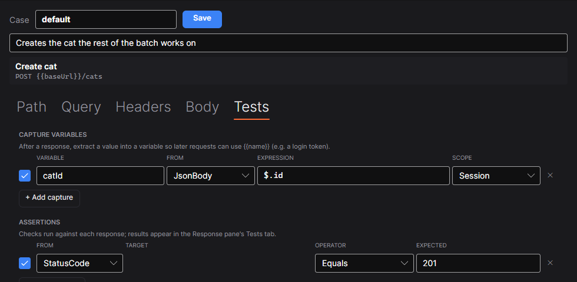
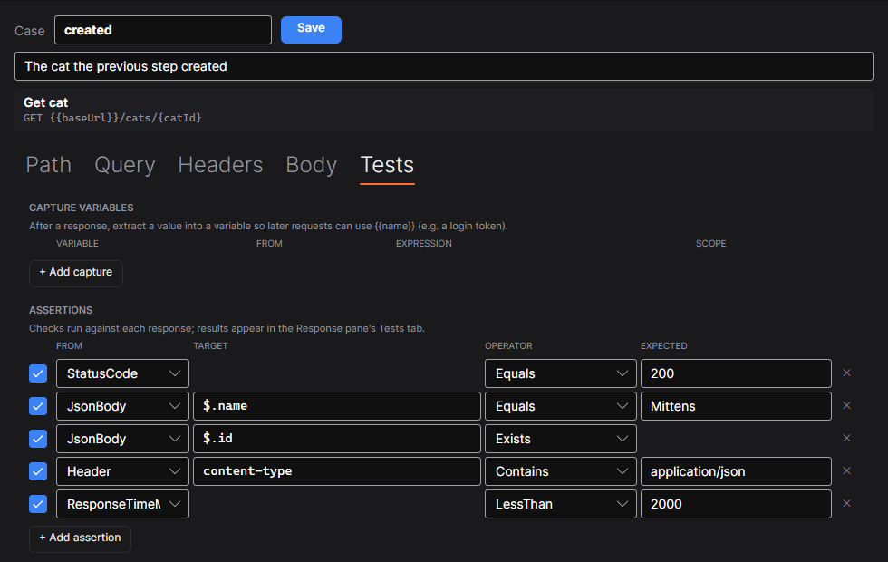

# Integration tests in Fubar API Studio

How to build a flow that calls several endpoints in order, passes values between them, checks each
answer, and cleans up after itself — whether or not it passed.

The worked example throughout is a lifecycle:

```
create a cat  →  read it back  →  rename it  →  delete it
```

Every file below is real, and the whole thing runs from the left pane or from CI with one command.

---

## 1 · The endpoints

An **endpoint** is what your API offers. It is true every time you call it, so it holds the method,
the URL, the headers and the auth — and nothing about any particular call.

`collections/cats/get-cat/endpoint.json`

```json
{
  "name": "Get cat",
  "method": "GET",
  "url": "{{baseUrl}}/cats/{catId}",
  "headers": [],
  "auth": { "type": "inherit" }
}
```

Two kinds of placeholder, and the difference matters:

| Syntax | Filled by | Example |
| --- | --- | --- |
| `{catId}` | the **case** — it is the endpoint's shape | `{{baseUrl}}/cats/{catId}` |
| `{{baseUrl}}` | the **environment**, session or workspace | `http://localhost:8479` |

They are separate so that a missing value can say which one it was. A `{param}` nobody filled is left
visible in the URL rather than emptied, because `/cats/` is a different request that will get a
plausible-looking answer from the wrong resource.

Four endpoints, one directory each:

```
collections/cats/
  _folder.json            headers, rules, and anything shared by all four
  create-cat/endpoint.json     POST   {{baseUrl}}/cats
  get-cat/endpoint.json        GET    {{baseUrl}}/cats/{catId}
  update-cat/endpoint.json     PUT    {{baseUrl}}/cats/{catId}
  delete-cat/endpoint.json     DELETE {{baseUrl}}/cats/{catId}
```

---

## 2 · Passing a value from one step to the next

The id only exists once the cat has been created, so the first step **captures** it and the rest
**read** it.

### Capturing

On the creating case, Tests tab → *Add capture*:



`collections/cats/create-cat/cases/default.json`

```json
{
  "name": "default",
  "description": "Creates the cat the rest of the batch works on",
  "body": { "type": "json", "raw": "{ \"name\": \"Mittens\" }" },
  "assertions": [
    { "source": "statusCode", "operator": "equals", "expected": "201" }
  ],
  "captures": [
    { "variableName": "catId", "source": "jsonBody",
      "expression": "$.id", "scope": "session" }
  ]
}
```

| Field | Means |
| --- | --- |
| `source` | `jsonBody`, `header`, `statusCode` or `responseTimeMs` |
| `expression` | JSONPath for `jsonBody`, a header name for `header`; ignored for the other two |
| `scope` | `session` — held in memory for this run, never written to disk<br>`environment` — persisted to `environments/*.json`, which is committed |

**Use `session` for anything a run produces.** `environment` writes to a tracked file, so it is for
values you actually want to keep; a created id is not one, and a token certainly is not.

### Reading it back

The three later cases fill the endpoint's `{catId}` with the variable:

`collections/cats/get-cat/cases/created.json`

```json
{
  "name": "created",
  "description": "The cat the previous step created",
  "pathParams": { "catId": "{{catId}}" }
}
```

That is the whole chaining mechanism. `{catId}` is replaced with the literal `{{catId}}`, which the
variable resolver then fills from whatever step 1 captured.

---

## 3 · Asserting each request

Assertions live on the **case**, because what an answer should look like depends on how you called
it. Tests tab → *Add assertion*:



`collections/cats/get-cat/cases/created.json`

```json
"assertions": [
  { "source": "statusCode",     "operator": "equals",   "expected": "200" },
  { "source": "jsonBody",  "target": "$.name",
                                "operator": "equals",   "expected": "Mittens" },
  { "source": "jsonBody",  "target": "$.id",
                                "operator": "exists" },
  { "source": "header",    "target": "content-type",
                                "operator": "contains", "expected": "application/json" },
  { "source": "responseTimeMs", "operator": "lessThan", "expected": "2000" }
]
```

### What you can read

| `source` | `target` | Reads |
| --- | --- | --- |
| `statusCode` | — | the HTTP status |
| `jsonBody` | JSONPath | one value from the response body |
| `header` | header name | one response header |
| `responseTimeMs` | — | how long it took |

### What you can say about it

| `operator` | Passes when | `expected` |
| --- | --- | --- |
| `equals` | exactly equal, case-sensitive | required |
| `notEquals` | not equal | required |
| `contains` | the value contains it, case-**insensitive** | required |
| `exists` | there is a value at all | ignored |
| `notExists` | there is not | ignored |
| `lessThan` | numerically less | required, numeric |
| `greaterThan` | numerically greater | required, numeric |

No script engine, on purpose: every rule is one row you can read in a diff, and a case file stays
something a reviewer can check.

### The rule that surprises people

**An HTTP status never fails a run on its own — only an assertion or a transport error does.**

You can assert `statusCode equals 404` deliberately, so a runner that also treated 4xx as failure
would be arguing with the thing you just told it to expect. The cost is that a request with no
assertions is judged only on whether it got an answer — so a non-2xx nobody asserted on is flagged on
its row with `!` and in a note, but does not fail the run.

If a status matters, assert it. Every case in this example does.

### Assertions replace, they do not merge

A case stating any assertions replaces the endpoint's. A `not-found` case expecting 404 cannot also
carry the endpoint's "status equals 200" — merged, one of the two is guaranteed to fail. A case
stating none inherits the endpoint's.

---

## 4 · The order, and the cleanup

A **batch** is the occasion: which calls to make, in what order, and what should judge them. It sits
beside the collection rather than inside it, because the tree says what your API has and a batch says
what to call this time.

`batches/cat-lifecycle.json`

```json
{
  "name": "cat-lifecycle",
  "description": "Create a cat, read it back, rename it, delete it",
  "steps": [
    { "endpoint": "cats/create-cat", "case": "default" },
    { "endpoint": "cats/get-cat",    "case": "created" },
    { "endpoint": "cats/update-cat", "case": "rename"  },
    { "endpoint": "cats/delete-cat", "case": "created" }
  ],
  "teardown": [
    { "endpoint": "cats/delete-cat", "case": "created" }
  ],
  "environments": ["Local"],
  "options": { "stopOnFailure": true }
}
```

- **The order is the batch's own**, never sorted. A batch that starts with a login is stating a
  dependency.
- **`stopOnFailure: true`** is right for a chain: carrying on past a broken create just produces three
  more failures that all say the same thing and bury the one that matters.
- **`case` is optional.** Leave it out and every case of that endpoint runs.
- A step naming an endpoint or case that no longer exists **errors**. A batch that quietly shrank when
  something was renamed would keep passing while testing one thing fewer.

### Why `teardown` exists

`stopOnFailure` is exactly what skips the delete. Without teardown, every failing run leaves a cat
behind — which over a week of red CI is a lot of rows nobody deletes.

Teardown runs after the steps **whatever happened to them**, and is cleanup rather than test:

- its assertions are dropped and it is not compared — a delete that finds nothing left to delete is
  the happy path, and reporting that as a failure on every green run is crying wolf;
- it never changes the verdict; what is reported is cleanup that could not be **sent**, as
  `1 cleanup step did not finish` beside the verdict;
- it does **not** run after you cancel. You asked it to stop.

Delete appears in both lists here on purpose: as a step it proves delete works, and as teardown it
tidies up the runs that never reached it.

---

## 5 · Running it

### In the app

The batch is a row in the left pane's **BATCHES** group, saying what it will do. *Run* opens the run
window with the batch's environment and oracle already chosen.

### From the command line

```bash
FubarAPIStudio run @cat-lifecycle -w ./cats --env Local
```

```
ok      1. create-cat#default  (201 · 63 ms)
ok      2. get-cat#created  (200 · 1 ms)
ok      3. update-cat#rename  (200 · 0 ms)
ok      4. delete-cat#created  (204 · 0 ms)
!       5. delete-cat#created  [cleanup]  (404 · 0 ms)

4/4 passed in 122 ms
```

Step 5 is the teardown finding the cat already gone — informational, and the run is green. Exit codes
are `0` passed, `1` something failed, `2` could not run.

When the chain breaks, the cleanup still happens:

```
ok      1. create-cat#default  (201 · 57 ms)
FAIL    2. get-cat#created  (200 · 1 ms)
        body $.name equals "Mittens" — got Marmalade
ok      5. delete-cat#created  [cleanup]  (204 · 0 ms)

1/4 passed, 1 failed, 2 skipped, 1 assertion failed
```

---

## 6 · Checking the whole response, not just the fields you thought of

Assertions check what you predicted. A **snapshot** checks everything else: record what each step
answers once, and later runs compare against it.

```bash
FubarAPIStudio run @cat-lifecycle -w ./cats --env Local --update-snapshots   # record
FubarAPIStudio run @cat-lifecycle -w ./cats --env Local --oracle snapshot    # compare
```

A chain has a problem here — the id is different every run — and one rule at the folder level solves
it for all four endpoints:

`collections/cats/_folder.json`

```json
{
  "headers": [{ "key": "Accept", "value": "application/json", "enabled": true }],
  "snapshot": {
    "normalize": {
      "add": [
        { "path": "$.id",        "as": "<cat-id>" },
        { "path": "$.createdAt", "as": "<timestamp>" }
      ]
    }
  }
}
```

Normalising replaces the volatile value **when the snapshot is written**, and the same rule is applied
to the live response before comparing — so the field is still checked for existence and shape, and the
file does not churn. The alternative, ignoring it, leaves the real value in a committed file and
hides the difference at compare time.

The recorded snapshot then reads:

```json
{
  "case": "created",
  "environment": "Local",
  "status": 200,
  "bodyFormat": "json",
  "body": {
    "createdAt": "<timestamp>",
    "id": "<cat-id>",
    "mood": "aloof",
    "name": "Mittens"
  }
}
```

**A missing snapshot fails the run.** "Nothing to compare, therefore fine" is how a suite stops
testing without anyone noticing.

---

## 7 · Where each rule can live

Everything inherits, so a rule that is true of the whole service is written once:

```
global (app settings) → collections/_folder.json → folder → endpoint.json → case → batch overlay
```

| Setting | Where it usually belongs |
| --- | --- |
| Headers, auth | folder — one service, one set |
| Assertions, captures, path params | case — they are about one call |
| Ignored paths, tolerances | folder for service-wide noise, case for a one-off |
| Snapshot redact / normalize | folder — the volatile fields are the same everywhere |

List settings state what they **add** and **remove** rather than replacing the inherited list:

```json
"comparison": { "ignoredPaths": { "add": ["$.meta.requestId"], "remove": ["$.version"] } }
```

so one extra rule on one endpoint does not mean restating its folder's — and does not silently stop
inheriting them.

---

## 8 · When it goes wrong

**`{{catId}} is not defined in the active environment or the workspace`** on step 2 means step 1 did
not capture it. The step that failed to capture is not the step that fails, so the reason is printed
on the step that caused it:

```
ok      1. create-cat#default  (201 · 63 ms)
        could not capture {{catId}}: No value for body $.identifier.
ERROR   2. get-cat#created  ({{catId}} is not defined ...)
```

A capture that finds nothing does not fail its own step — the request answered, and whether a missing
field matters is what an assertion is for. If the capture is essential, assert on the same field:

```json
{ "source": "jsonBody", "target": "$.id", "operator": "exists" }
```

**Everything after step 1 is skipped** — that is `stopOnFailure`, and it is what you want. The summary
counts them (`2 skipped`) so the report cannot read as a shorter run than it was.

**The run is green but a row shows `!`** — a non-2xx that no assertion judged. Assert on the status
if it matters.

---

## See also

- [`spec-endpoints.md`](spec-endpoints.md) — the format in full: what is on disk, how the hierarchy
  resolves, every CLI selector, and what is deliberately not built.
- [`api-studio.md`](api-studio.md) — the rest of the app.
